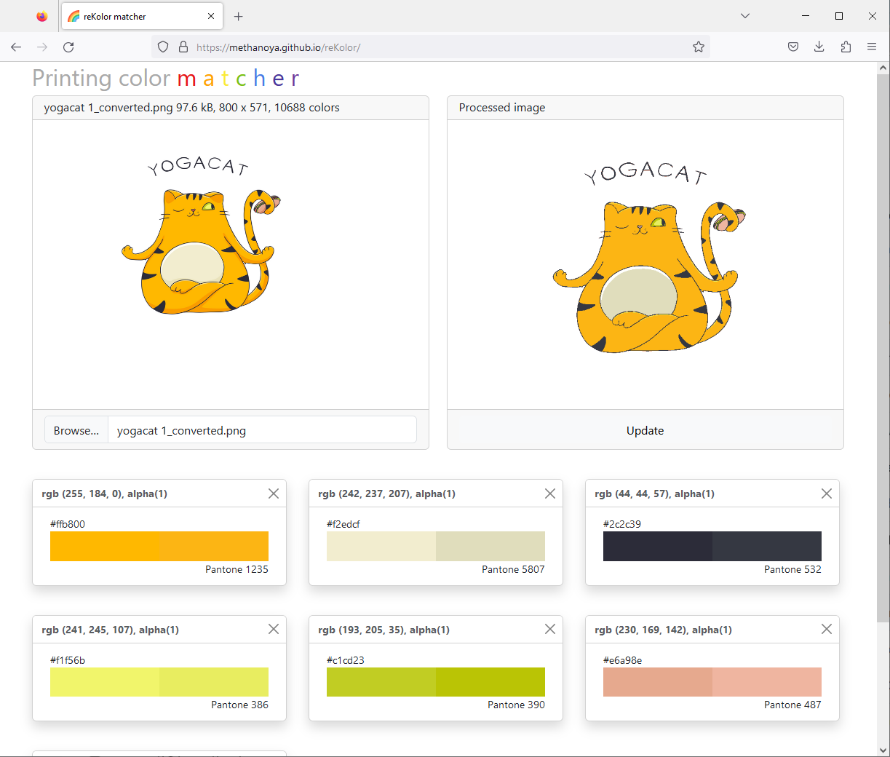

# reKolor

This made as a printing preview tool for limited palette pictures on bags, t-shirts, walls, etc. 
For now, it works with [Pantone](https://www.pantone.com/articles/color-palettes) palette. The good color match is based on [CIEDE2000](https://en.wikipedia.org/wiki/Color_difference#CIEDE2000) color distance.

See the tool on [https://methanoya.github.io/reKolor/](https://methanoya.github.io/reKolor/)

It uses Typescript, Rust, WebAssembly, Svelte

