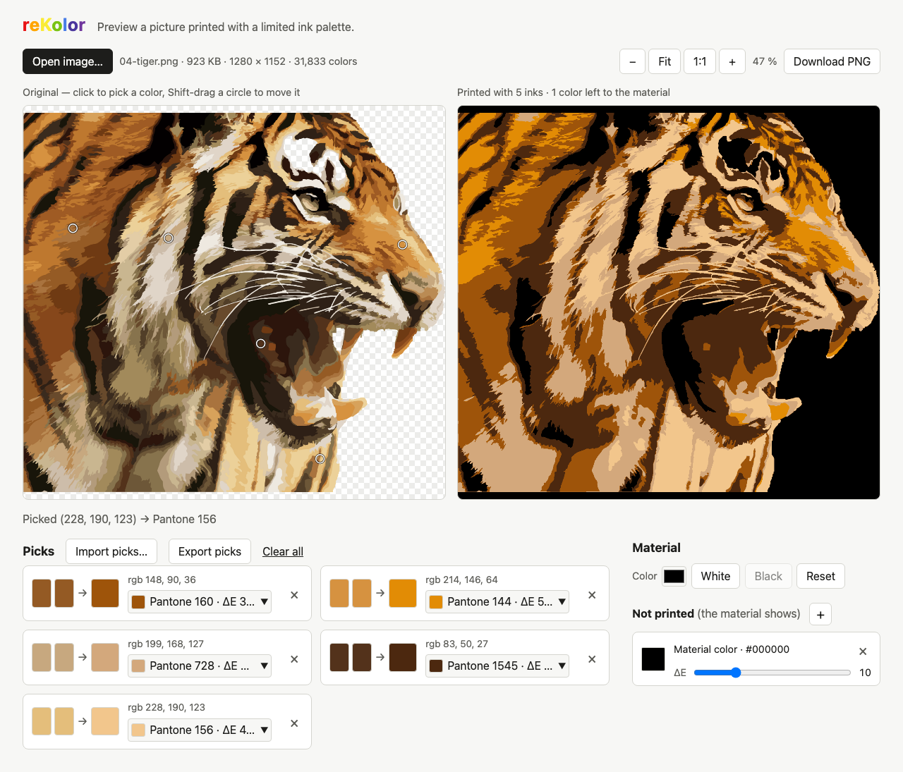

# reKolor

Preview how a picture prints with a limited ink palette, on a bag, a T-shirt, a wall or any other
material. Open an image and click the colors to keep: each one is replaced by its nearest
[Pantone](https://www.pantone.com/articles/color-palettes) ink, matched by
[CIEDE2000](https://en.wikipedia.org/wiki/Color_difference#CIEDE2000) color distance, and the
preview updates as you pick.

Try it at [methanoya.github.io/reKolor](https://methanoya.github.io/reKolor/).

- **Picks:** every pixel takes the ink of the nearest picked color. Each pick suggests the nearest
  Pantone ink; the list offers the next closest ones. Shift-drag a pick's circle to move it.
- **Material:** the color of the garment or surface. Colors are matched as they look on it, and the
  preview shows it behind the print.
- **Not printed:** colors the material already has need no ink. Pixels within a chosen distance of
  them stay transparent in the downloaded PNG, so the material shows through.
- **Palette configs:** export the picks, the material and the unprinted colors as a
  `*.palettes.toml` file and import them again, in the app or with the `rekolor` command-line tool.

The color engine is written in Rust and runs in the browser as WebAssembly, in a Web Worker; the
web app is Svelte and TypeScript.

## Project layout

| Folder | What |
|---|---|
| `rust/` | The color engine as a Cargo workspace: pure core, WASM interface, file I/O, palette configs and the `rekolor` CLI. See [rust/README.md](rust/README.md). |
| `typescript/` | The web app (Svelte, TypeScript, Vite), running the WASM engine in a Web Worker. See [typescript/README.md](typescript/README.md). |
| `palettes/` | The Pantone palette (`pantone.json`). |
| `samples/` | The golden set: sample images, their palette configs and the reviewed outputs. |

## Building and testing

- The web app: [typescript/README.md](typescript/README.md) (build the WASM package, `npm ci`,
  `npm run dev`).
- The engine and the CLI: [rust/README.md](rust/README.md) (requirements, checks and the golden
  set).
